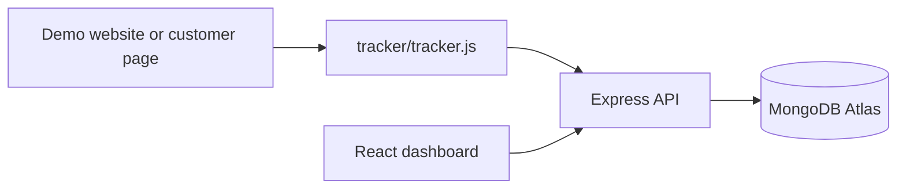

# Data Pulse

Data Pulse is a production-ready user analytics application for tracking page views, clicks, user sessions, and page-level heatmap activity. It includes an embeddable JavaScript tracker, an Express/Mongoose API, a React analytics dashboard, and a demo storefront that generates realistic activity.

## Architecture



## Tech Stack

- Frontend: React 19, Vite, TypeScript, Tailwind CSS, Axios, React Router, Recharts-ready
- Backend: Node.js, Express, TypeScript, Mongoose, Zod
- Database: MongoDB Atlas or local MongoDB
- Production: Vercel frontend, Render backend, MongoDB Atlas

## Folder Structure

```text
backend/
  src/
    config/       Environment and database setup
    controllers/  HTTP request handlers
    middleware/   Error and 404 handling
    models/       Mongoose schemas and indexes
    routes/       Express routers
    services/     Business logic and aggregation queries
    utils/        Validation, logging, async helpers
frontend/
  src/
    components/   Reusable dashboard UI
    hooks/        Async state hooks
    layouts/      Dashboard and demo shells
    pages/        Sessions, session detail, heatmap, demo pages
    services/     Axios API layer
    types/        Shared frontend types
tracker/
  tracker.js      Standalone embeddable analytics script
```

## Setup

```bash
npm install
cp backend/.env.example backend/.env
cp frontend/.env.example frontend/.env
```

Set `backend/.env`:

```bash
NODE_ENV=development
PORT=4000
MONGODB_URI=mongodb+srv://<username>:<password>@<cluster>/<database>?retryWrites=true&w=majority
CORS_ORIGIN=http://localhost:5173
LOG_FORMAT=dev
```

Set `frontend/.env`:

```bash
VITE_API_BASE_URL=http://localhost:4000/api
VITE_TRACKING_ENDPOINT=http://localhost:4000/api/events
```

## Running Locally

Start the API:

```bash
npm run dev:backend
```

Start the dashboard and demo site:

```bash
npm run dev:frontend
```

Open:

- Dashboard: `http://localhost:5173/sessions`
- Heatmap: `http://localhost:5173/heatmap`
- Demo site: `http://localhost:5173/demo`
- API health: `http://localhost:4000/health`

## Tracker Usage

Embed the script on any webpage:

```html
<script
  defer
  src="https://your-frontend-domain.com/tracker.js"
  data-endpoint="https://your-api-domain.com/api/events"
></script>
```

The tracker:

- Creates and persists a UUID session ID in `localStorage`
- Sends `page_view` events on load and SPA route changes
- Sends `click` events with page coordinates
- Retries failed requests with exponential backoff
- Stores a bounded retry queue in `localStorage`
- Catches internal errors so host pages do not crash

Optional attributes:

- `data-storage-key`: custom localStorage session key
- `data-track-path-prefix`: only track paths with a specific prefix, used by the demo site

## API Documentation

### `POST /api/events`

Stores a tracking event.

```json
{
  "sessionId": "uuid",
  "eventType": "click",
  "pageUrl": "/demo/products",
  "timestamp": "2026-06-17T12:00:00.000Z",
  "x": 240,
  "y": 480
}
```

Response:

```json
{ "success": true }
```

### `GET /api/sessions`

Returns session summaries sorted by latest activity.

```json
[
  {
    "sessionId": "uuid",
    "totalEvents": 12,
    "firstVisit": "2026-06-17T12:00:00.000Z",
    "lastActivity": "2026-06-17T12:08:00.000Z",
    "durationMs": 480000,
    "pageViews": 3,
    "clicks": 9
  }
]
```

### `GET /api/sessions/:sessionId`

Returns chronological events for one session.

### `GET /api/heatmap?pageUrl=/demo/products`

Returns click coordinates for the selected page.

```json
[
  { "x": 120, "y": 300 },
  { "x": 200, "y": 150 }
]
```

### `GET /api/pages`

Returns unique tracked page URLs.

### `GET /api/summary`

Returns dashboard totals for sessions, events, pages, page views, clicks, and recent activity.

## Deployment

### MongoDB Atlas

1. Create a MongoDB Atlas cluster.
2. Add a database user and password.
3. Allow the Render backend IP range or `0.0.0.0/0` for a demo environment.
4. Copy the connection string into `MONGODB_URI`.

### Render Backend

1. Create a new Web Service from this repository.
2. Set root directory to `backend` if deploying the backend alone, or keep repository root and use the workspace commands below.
3. Build command from repository root: `npm install && npm run build -w backend`
4. Start command from repository root: `npm start -w backend`
5. Add environment variables from `backend/.env.example`.
6. Set `CORS_ORIGIN` to the Vercel frontend URL.

### Vercel Frontend

1. Create a Vercel project from this repository.
2. Set root directory to `frontend`.
3. Build command: `npm run build`
4. Output directory: `dist`
5. Add `VITE_API_BASE_URL=https://your-render-service.onrender.com/api`.
6. Add `VITE_TRACKING_ENDPOINT=https://your-render-service.onrender.com/api/events`.

Because the Vite config uses `../tracker` as the public directory, deploying from the repository root is the smoothest path. If Vercel is configured with `frontend` as the root, copy `tracker/tracker.js` into that deployment or adjust `publicDir` for that environment.

## Database Design

Events are stored in one MongoDB collection:

```ts
{
  sessionId: string;
  eventType: 'page_view' | 'click';
  pageUrl: string;
  timestamp: Date;
  clickData?: {
    x: number;
    y: number;
  };
}
```

Indexes:

- `sessionId`
- `pageUrl`
- `timestamp`
- Compound `sessionId + timestamp`
- Compound `pageUrl + eventType + timestamp`

## Assumptions

- `pageUrl` is stored as `pathname + search` so demo, dashboard, and customer pages group cleanly by route.
- Click heatmaps use observed coordinate space because the requested event shape does not include viewport dimensions.
- The tracker accepts top-level `x` and `y`, while the database stores them under `clickData`.
- Authentication is outside the scope of this build, but the API structure leaves room for protected dashboard routes.

## Trade-offs

- Events are written individually for clarity and immediate visibility. The tracker has retry queuing, and the backend can be extended with batch ingestion.
- The heatmap is a lightweight coordinate visualization rather than a canvas-based density renderer.
- The demo app is served from the dashboard frontend to keep local setup simple.

## Future Improvements

- Batch event ingestion endpoint
- Viewport and element metadata capture
- Authenticated organizations and API keys
- Date range filters and pagination
- Exportable session replays
- Real density heatmap rendering
- Automated integration tests with an in-memory MongoDB

